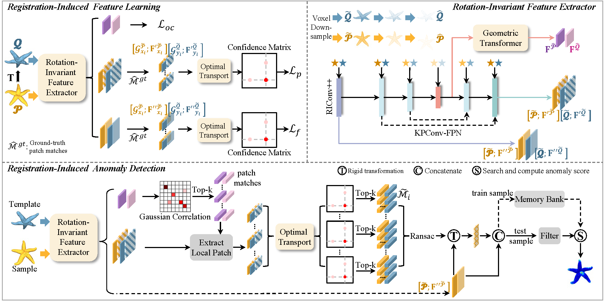

# Registration is a Powerful Rotation-Invariance Learner for 3D Anomaly Detection
> [**NeurIPS 25**] [**Registration is a Powerful Rotation-Invariance Learner for 3D Anomaly Detection**](https://arxiv.org/abs/2510.16865)
>
> by Yuyang Yu∗, Zhengwei Chen∗, Xuemiao Xu, Lei Zhang, Haoxin Yang,  Yongwei Nie,  Shengfeng He


>**The overview of Reg2Inv.** In the feature learning stage, the model learns features via a registration task that enforces geometric alignment and multi-scale consistency between paired point clouds. At inference time, the model computes a registration matrix for alignment with the prototype and extracts rotation-invariant features for anomaly detection. The feature extractor is designed to obtain a set of features for anomaly detection and two sets of features for registration.

***Abstrat:*** 3D anomaly detection in point-cloud data is critical for industrial quality control, aiming to identify structural defects with high reliability. However, current memory bank-based methods often suffer from inconsistent feature transformations and limited discriminative capacity, particularly in capturing local geometric details and achieving rotation invariance. These limitations become more pronounced when registration fails, leading to unreliable detection results.We argue that point-cloud registration plays an essential role not only in aligning geometric structures but also in guiding feature extraction toward rotation-invariant and locally discriminative representations. To this end, we propose a registration-induced, rotation-invariant feature extraction framework that integrates the objectives of point-cloud registration and memory-based anomaly detection. Our key insight is that both tasks rely on modeling local geometric structures and leveraging feature similarity across samples. By embedding feature extraction into the registration learning process, our framework jointly optimizes alignment and representation learning. This integration enables the network to acquire features that are both robust to rotations and highly effective for anomaly detection.Extensive experiments on the Anomaly-ShapeNet and Real3D-AD datasets demonstrate that our method consistently outperforms existing approaches in effectiveness and generalizability.

##  Getting Started

### Setup 
1. Clone the repo:
```bash
git https://github.com/CHen-ZH-W/Reg2Inv
cd Reg2Inv
```
2. Create a new environment and install the libraries:
```bash
conda create -n reg2inv python==3.8.19
conda activate reg2inv
conda install pytorch==1.12.1 torchvision==0.13.1 torchaudio==0.12.1 cudatoolkit=11.3 -c pytorch
pip install -r requirements.txt
pip install --upgrade https://github.com/unlimblue/KNN_CUDA/releases/download/0.2/KNN_CUDA-0.2-py3-none-any.whl
python setup.py build develop
```

### Dataset Preparation
1. Please download Real3D-AD dataset from [Real3D-AD dataset](https://github.com/M-3LAB/Real3D-AD), Anomaly-ShapeNet dataset from [Anomaly-ShapeNet dataset](https://github.com/Chopper-233/Anomaly-ShapeNet).
2. Extract into **./data/**.
```
data
├── Real3D-AD-PCD
    ├── airplane
        ├── train
            ├── 1_prototype.pcd
            ├── 2_prototype.pcd
            ...
        ├── test
            ├── 1_bulge.pcd
            ├── 2_sink.pcd
            ...
        ├── gt
            ├── 1_bulge.txt
            ├── 2_sink.txt
            ... 
    ├── car
    ...

├── Anomaly-ShapeNet-v2
    ├── dataset
        ├── pcd
            ├── ashtray0
                ├── train
                    ├── *template.pcd
                    ...
                ├── test
                    ├── 1_bulge.pcd
                    ├── 2_concavity.pcd
                    ...
                ├── GT
                    ├── 1_bulge.txt
                    ├── 2_sink.txt
                    ... 
            ├── bag0
            ...
```

### Training
We provide two datasets to train Reg2Inv, Real3D-AD and Anomaly-ShapeNet. The results are in the **./output_real3dad** folder and **./output_real3dad** folder. For convenience, the released code differs slightly from the version used in the paper. 
In this version, each dataset only needs to be trained once, and the detection performance is comparable to training individual categories separately.
```bash
# For training Real3D-AD
# unset LD_LIBRARY_PATH
CUDA_VISIBLE_DEVICES=0 python train_real3dad.py
```
```bash
# For training Anomaly-ShapeNet
# unset LD_LIBRARY_PATH
CUDA_VISIBLE_DEVICES=0 python train_shapenet.py
```
If you encounter the errors: RuntimeError: CUDA error: CUBLAS_STATUS_INVALID_VALUE when calling 'cublasSgemm( handle, opa, opb, m, n, k, &alpha, a, lda, b, ldb, &beta, c, ldc)'.
Please try running the following command before training or testing: **unset LD_LIBRARY_PATH**.

### Testing
We provide two datasets to test Reg2Inv. The results are in the **./results** folder. We provide pre-trained weights in [Google Drive(Real3D-AD)](https://drive.google.com/file/d/13tXihXZJoF53n_ZQtNVvGlqOr7woNfq0/view?usp=drive_link) and [Google Drive(Anomaly-ShapeNet)](https://drive.google.com/file/d/1PDiMDtdMFxhW_rN5l36JPF7AOI9sguOV/view?usp=drive_link).
```bash
# For testing Real3D-AD
# unset LD_LIBRARY_PATH
python test.py real3dad
```
```bash
# For testing Anomaly-ShapeNet
# unset LD_LIBRARY_PATH
python test.py shapenet
```
## Acknowledgement
We thank the great works [GeoTransformer](https://github.com/qinzheng93/GeoTransformer), [RIConv++](https://github.com/cszyzhang/riconv2), [Real3D-AD](https://github.com/M-3LAB/Real3D-AD), [Patchcore](https://github.com/amazon-science/patchcore-inspection), and [CPMF](https://github.com/caoyunkang/CPMF) for assisting with our work.

## Citation
If you find this repository useful, please consider citing our work:
